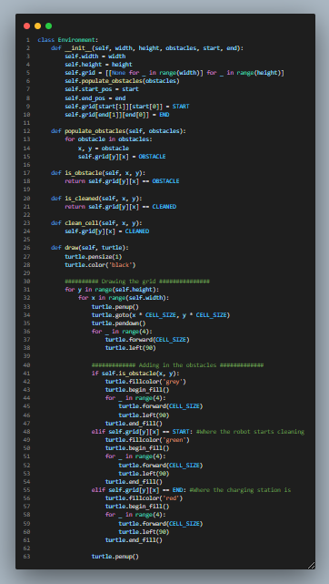
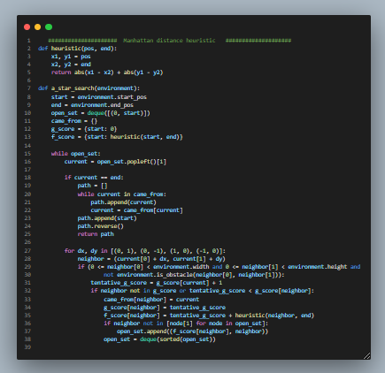
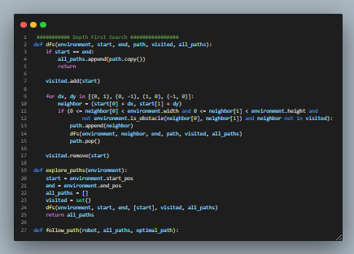
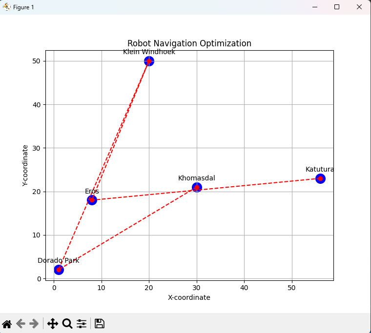
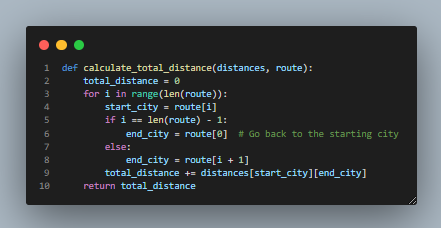
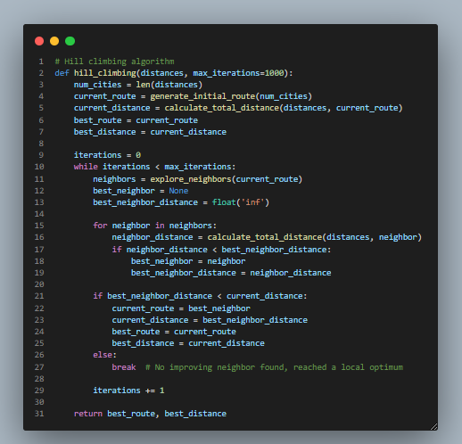
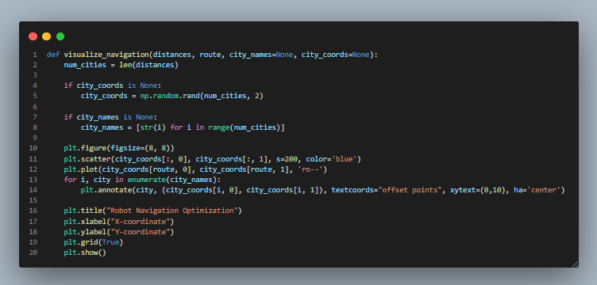

# Home Cleaning Robot & Traveling Salesman Problem Solver
## Description

### This repository contains the implementation of two algorithms:

## Question 1

 A* search algorithm for a home cleaning robot navigating in a rectangular environment with obstacles.

 

##### to run the application

python GUI.py

#### Code for constructing the enveronment

#### 1.The heuristic function calculates the heuristic value (estimated cost) from a given position to the target position. It uses the Manhattan distance heuristic, which calculates the sum of the absolute differences in the x and y coordinates between two points.
#### 2.The a_star_search function implements the A* search algorithm to find the optimal path from the start position to the end position in the environment.

 ### Depth First Search 

## Question 2

#### This repository explores the application of the Hill climbing algorithm for solving the Traveling Salesman Problem (TSP) in the context of visiting various places in Windhoek. The objective is to visit a set of places exactly once, returning to the starting point, while minimizing total travel distance.

##### to run the application

pip install matplotlib>=3.0.0 numpy>=1.16.0

python V2.py

#### Total Distance

#### Hill Climbing Algorithm

#### visualisation function
